# 
 2D computer vision - Darts game analysis 
  
    
    
## Table of Contents 

1. [Problem statement](#problem)   
1. [Project navigation](#navigation)   
2. [Description of project logic](#logic)    
3. [Example of program operation](#performance_example)     
4. [How to run code on your device & Usage](#run_code) 

## Problem Statement    

[Table of Content](#content)    

The task of the project is to use computer vision methods to determine the score of each player in darts game and on this basis to determine the winner.    

The problem is solved with only three images, without a large dataset to allow the use of deep learning.   

Darts game example:   

    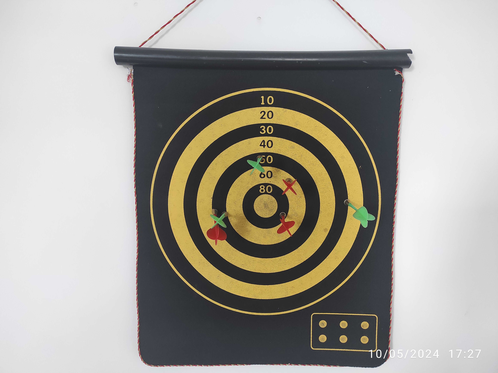
    
Original image

## Project navigation   

[Table of Contents](#content)  

* `data` folder contains images with darts games;
* `pics` folder contains the supporting images for this notebook;
* `results` folder contains processed images from `data` folder with detected score drawn on them;    
* `utils.py` file contains all the functions that I use to process darts game images;  
* `main.py` file perform image analysis using functions from the `utils.py` with the ability to visualize each step;
* `requirements.txt` is a list of required libraries and their versions.    

## Description of project logic  

[Table of Contents](#content) 

I solved the problem of darts game analysis using color filters and contour analysis from `opencv` library. I will show the logic of the solution on the example of the first image that look like this:     

    
    
Original image

   

##### First step (*implemented in `find_dartboard_contours` function*)       

First I define the contours of the dartboard. To do this, I convert the image to HSV format and find the large yellow shaded contours. Then I find the largest contour, which is the outer contour of the field, and draw a circle around it.

  

    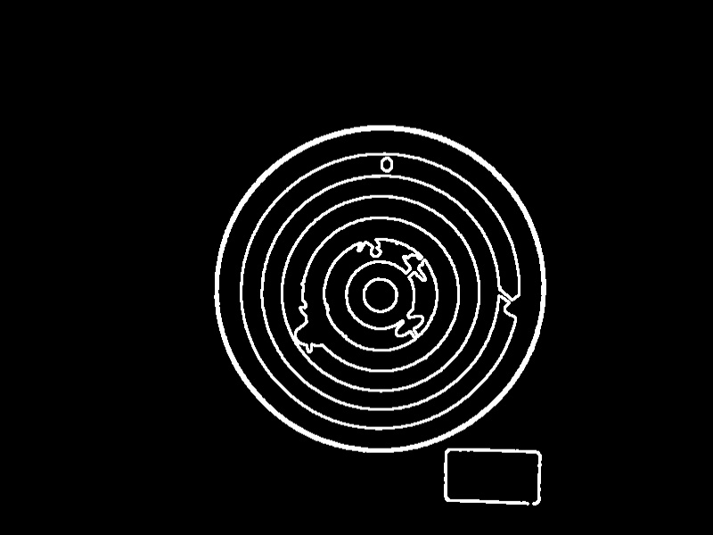
    
Yellow contours drawn in grayscale

  

  
  

    
    
The largest circle

  

I then find the remaining 7 circles using a loop like this:

1) I crop the image to avoid finding the previous found circle again;
2) Find the circles in the cropped image using Hough's algorithm;
3) Select the largest one; (repeat the loop until 7 circles are found).   

It is **important** to say that I use a reduced image (by a factor of 5.8) to find the contours of the inner circles. I do this so that Hough's algorithm finds the circles more accurately by reducing noise and works faster due to fewer pixels. After that, I multiply the found centers of the circles and radiuses by 5.8 to go back to the original image size.    

The operation of the loop looks like this:  

  

    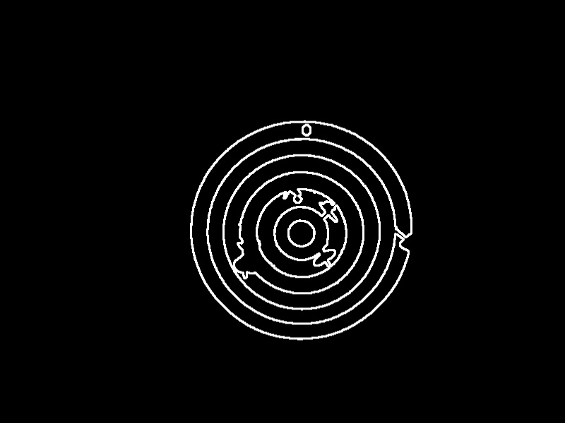
    
First cropp

  

  
  

    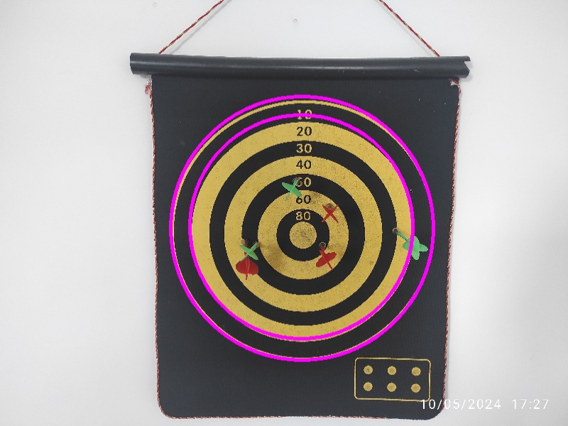
    
Second circle

  

  

    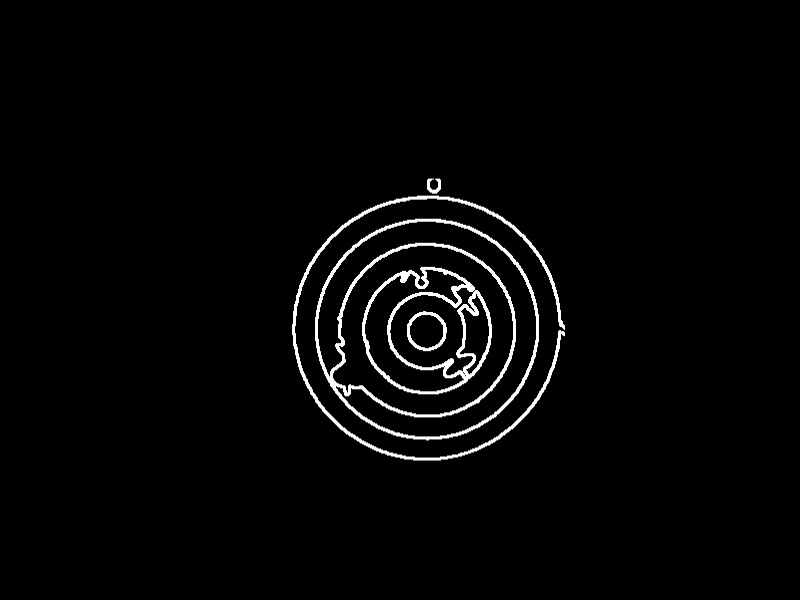
    
Second cropp

  

  
  

    
    
Third circle

  

  

    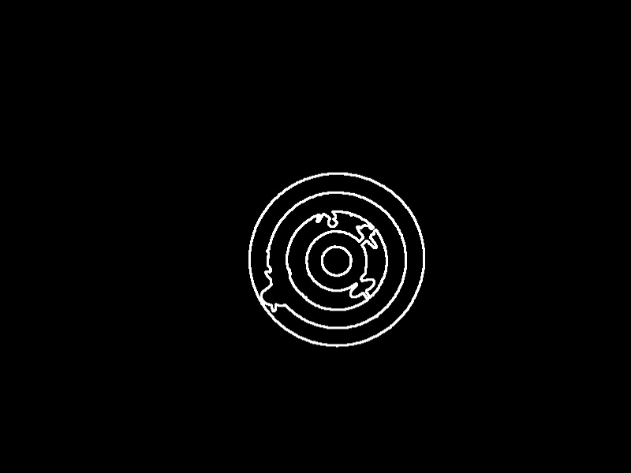
    
Third cropp

  

  
  

    
    
Fourth circle

  

  

    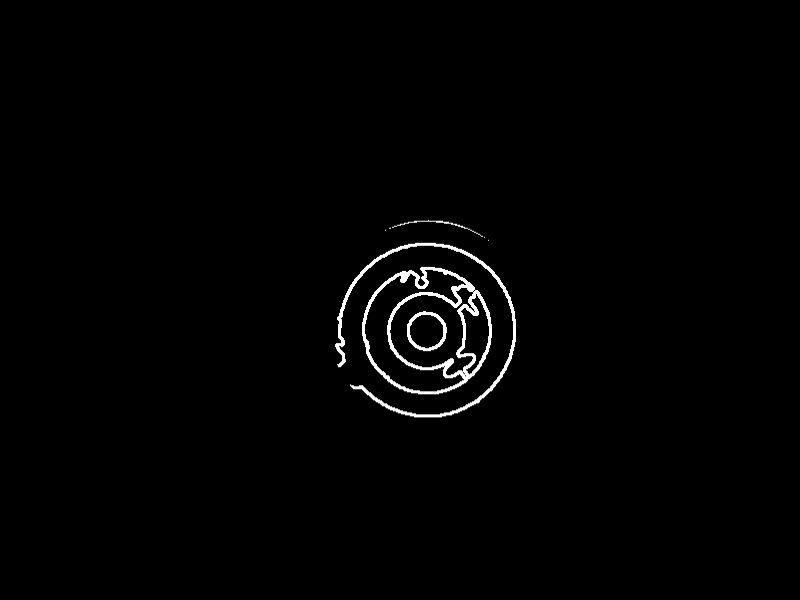
    
Fourth cropp

  

  
  

    
    
Fifth circle

  

  

    
    
Fifth cropp

  

  
  

    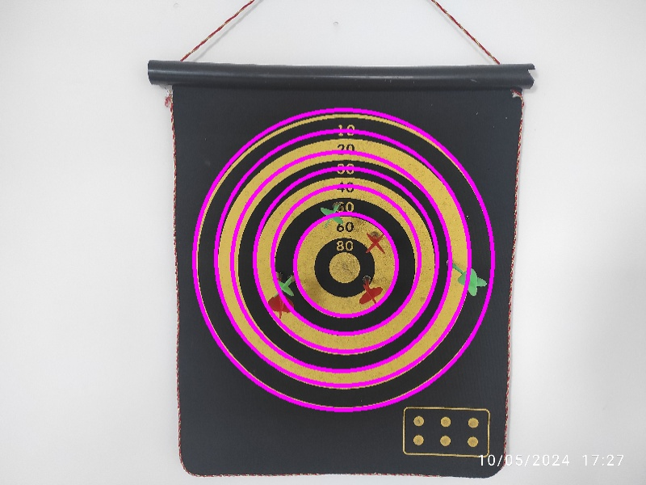
    
Sixth circle

  

 

  

    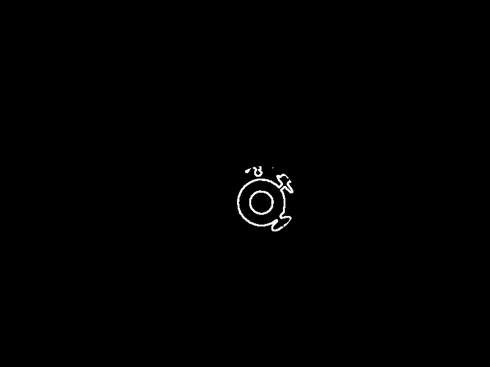
    
Sixth cropp

  

  
  

    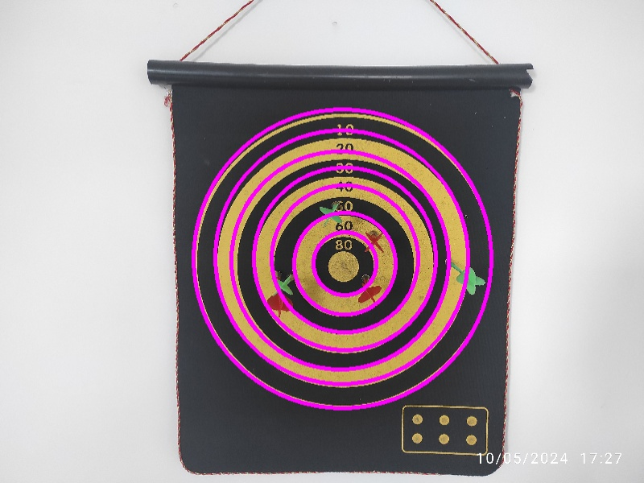
    
Seventh circle

  

  

    
    
Seventh cropp

  

  
  

    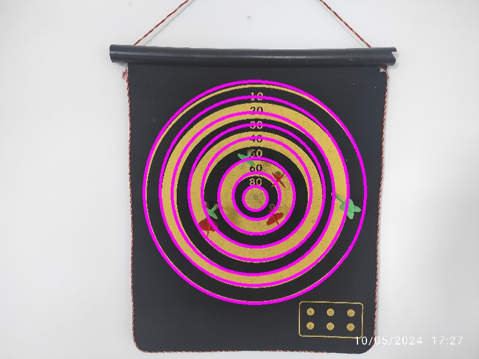
    
Last circle

  

       

##### Second step (*implemented in `get_darts_contours` function* ) 

I find the contours of the red and green darts. For this I also use HSV space translation and color filtering. Then I select three red and green contours each with the largest area.       

The contours found look like this:     

    
    
Darts conrours

I perform a check to see if there is a huge difference between the smallest and largest dart contour areas. If yes, it means that the darts of the same color were close to each other and were combined into one contour. I separate such darts using erosion and dilation.     

Example of separated contours below. (This is the processing of picture 3):

    
    
Separated darts conrours

    

*Separation of close contours is implemented in `separate_close_contours` function*    

##### Third step  (*implemented in `get_heads_contours` function* )

Now I find the heads of the darts. To do this, I again apply color filtering in HSV space. Next I select the 6 largest contours, because that's how many heads I'm looking for in the image. The head contours can also merge, so I separate them the same way I separated the close dart contours.  

    
    
Heads contours

    

##### Fourth step (*implemented in `find_darts_coordinates` function*)

Next, I try to “attach” the contour of each dart to the contour of some head. This will give the most accurate prediction of the location, because it is determined by the head.    

In order to do this, I get masks of all darts and heads, then I enlarge them with `cv2.dilate()` to find intersections. I then count the number of pixels the enlarged contour of the dart has in common with the enlarged contours of each of the heads. I associate the dart with the head that has the greatest intersection with the dart contour in pixels.    

I define the location of the dart that managed to be connected with a head as the coordinates of the middle pixel of the head contour.

But connecting the dart to the head is not always possible. First, the head may not be visible behind the dart. Secondly, the color range of heads is very close to the color range of the dartboard (yellow circles). This can lead to incorrect head detection.    

I had two theories on how best to determine the location of a headless dart: by the middle pixel of the dart contour, or by the top pixel. 

Both make sense, you can see successful examples of both approaches in the images below. 

  

    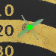
    
Successful middle strategy (from 2nd img)

  

  
  

    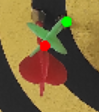
    
Successful top strategy

  

I have only three pictures, and on such a small test set I cannot objectively evaluate which approach gives correct results more often. In the three pictures, both strategies give the same number of correct and incorrect predictions (I consider a correct prediction to be the one that gives a correct score).     

However, it seems to me that the strategy with the middle pixel will work more often, because the head may not be visible if the dart hits straight and doesn't deflect downwards, as in the left picture above. The strategy with the top pixel works well when the dart, on the contrary, deflects downwards, as in the right picture above. But in this case you will probably be able to find the head and locate the dart by it. 

As a result, I get these dart coordinates:   

    
    
Darts Coordinates

    

   
##### Fifth step (*implemented in `darts_coordinates_to_score` function*)  

Finally, I determine the number of points scored by each dart.   

In the [first step](#first_step), I found the centers and radiuses of the circles on the dartboard. Since the original images have perspective distortion, the circles on the dartboard are not even circles, and the centers of these circles are slightly off. So I find the single center of the dartboard as the average of the centers of all eight circles.    

Next, I collect all the radiuses in one variable in ascending order.   

Then for each point (dart coordinates) I find the distance to the center in pixels, and start comparing it to the radiuses of the circles, starting with the smallest circle. As soon as the distance from the dart to the center is less than the radius of some circle, I assign scores corresponding to that circle to that dart.    

If the distance to the center is greater than the radius of the largest circle, that dart gets 0 score.   
  

## Example of program operation 

[Table of Contents](#content)
    

The `visualize_score` and `save_results` functions visualize and save the final result, respectively.     

The final result for the first image looks like this:   

    
    
Game Results

    

All the results are saved in `results` directory.   

## How to run code on your device & Usage  

[Table of Contents](#content)

To install all required dependencies, run the `requirements.txt` file from the root directory of the project:    
> pip install -r requirements.txt

To get the prediction on your image, in the `main.py` file, replace the value of the `image_path` variable with the path to your image (eleventh line of code) and execute:   
> python main.py

Remember that the program will only process your image correctly if your dartboard and darts match the color scheme of the images shown in this notebook, as color filters are an important part of the solution.   

**Visualisation**   
You can also visualize any step of an algorithm or combination of them. To do this, replace `False` with `True` in the condition before the desired visualisation.    

Example:

    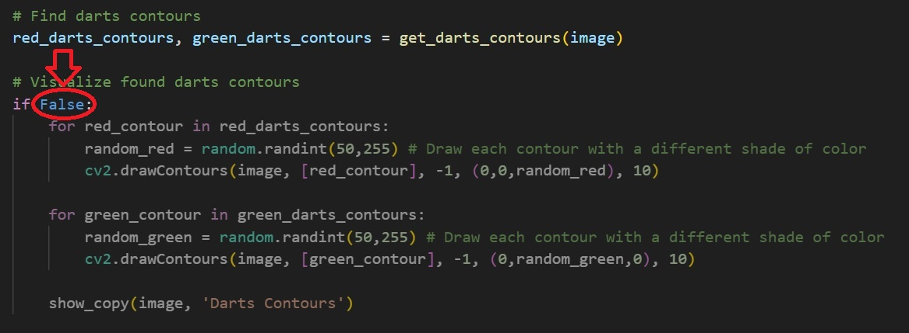
    
Change this, if you want to visualize found darts contous

       